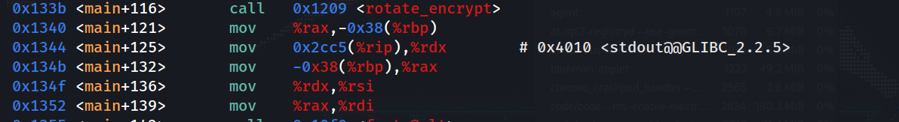
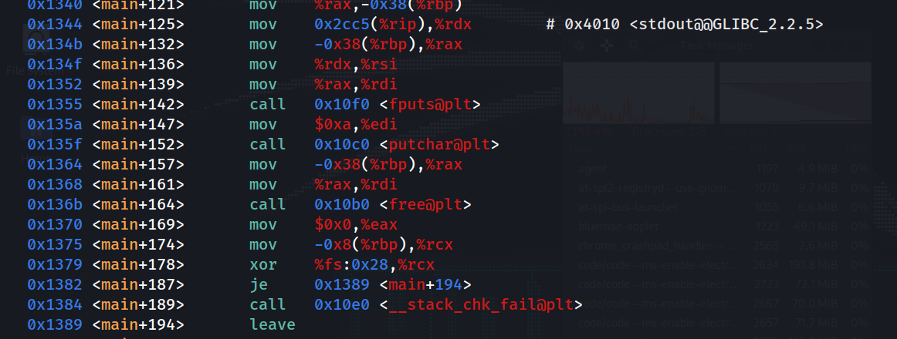
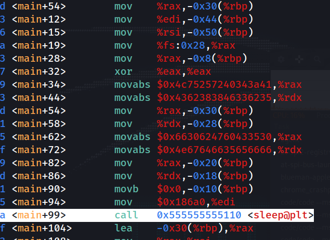

# GDB Analysis
### I am not really good reading asm, but i'll be able later !

### Functions :
- rotate_encrpty ( Return Something , )

- Main Function
- We do know that is A sleep Function There 

But i dont know for how long

#### But a debugger can skip that sleep, take a look at this picture 

- Dari sini kita bisa melihat bahwasanya sehabis main+99 kita memanggil yang namanya rotate function ( means sehabis sleep selesai di eksekusi) and the funny thing is that selesai eksekusi function terdapat STD:OUT, which is outputting something

dan disistu pula kita melihat terdapat pemanggilan kedua fungsi ini fputs & putchar, Sepertinya untuk memperlihatkkanya ke display

- The answer could be from RBP Register, i mean the FLAG !
Just unddewrsxtand the Flow, 

- Makanya ketika kamu coba eksekusi kode si rotate_encrypt, you get the output Right ? dan the input itself is a VARIABLE, but i dont know yet if that was a flag rn, since my knowledge of assembly not really depth

## Flag : picoCTF{d3bugg3r_dr1v3_7776d758}