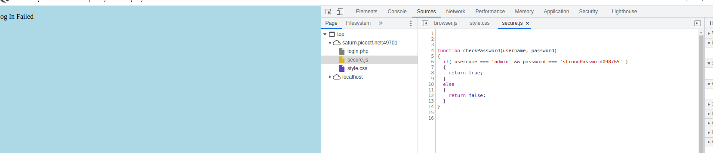
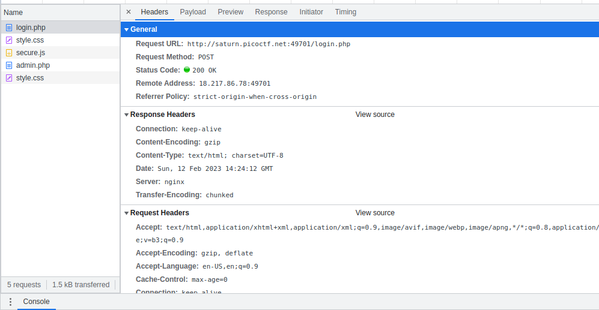

### STEP 
- Attempt to login, Result Kek gitu, Out secure.js & login.php



## Analysis of js file
- The js file only contain function checkPassword(), it will be called by the login.php, the answer at the js file

## Analysis of login.php file
Basically there's a hash value :
2196812e91c29df34f5e217cfd639881
if it decrypted you get the flag, but since its from admin.php, there's no way xD

use the network analysis approach

### Analysis of the network Traffic


- login.php
    - POST 
    - Dipanggil saat Submit button pressed
    - NO RESPONSE DATA
- secure.js
    - GET
    - No additional information
- admin.php
    - POST
    - SENDING HASH, keknya pas udah tau id dan password yang benar
    - RESPONSE DATA HTML
    - Use Curl to get it without login credentials
```
curl -X POST --data hash=2196812e91c29df34f5e217cfd639881 http://saturn.picoctf.net:49701/admin.php > ans.txt
```

Alur --> login -> GET secure.js -> admin 


### Answer
- Just by adding the true login id & password 
    picoCTF{j5_15_7r4n5p4r3n7_8086bcb1}
- or that curl