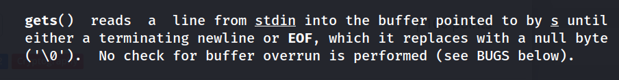
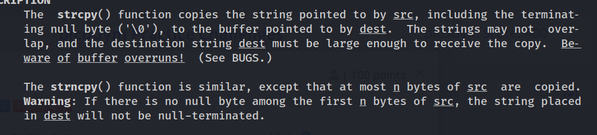

# README

## Basically ini mudah xD
-- Clue ada di 
    gets()
    strcpy()
    dan juga Buffernya
    
    
    
    Dari gets dlu, from gets sebenarnya dia bakalan baca input dari stdin SAMPAI a terminating newline ATAU End of file (EOF) didapat, return s, s itu arr of chars jika sukses, Namun disini kekurangannya 
    dia tidak punya buffer OVERRUN CHECKING, maka tidak ada jaminan fungsi tersebut AKAN RETURN !
    DALAM ARTIAN, KETIKA GETS mencoba read, dia gatau itu ada berapa banyak, dan karena gatau ada berapa banyak, ada kemungkinan dapat dimanipulasi di kemudia waktu. COBA MASUKIN AJA lebih dari 100 bytes , langsung break program dan ngasih FLAGNya

    
    strcpy(), fungsi normalnya copy doang. Tapi coba liat disitu, yang pertama dia ga punya N byte, jadi dia gabatasin tuh besaran bytes yang dapat di copy, ini dapat membuat OVERFLOW buffer nantinya
    
    TERUS KAN KADANG ITU KALAU KITA MASUKIN banyak char, itu di vuln udah break TAPI BELUM BUFFER OVERFLOWW, terus? karena GETS itu masih ada sisa, coba masukin terus, ntar muncul juga

    